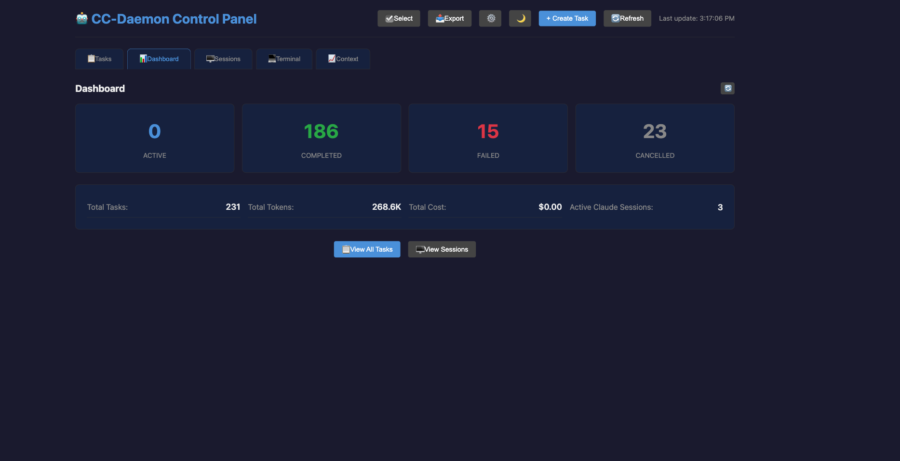
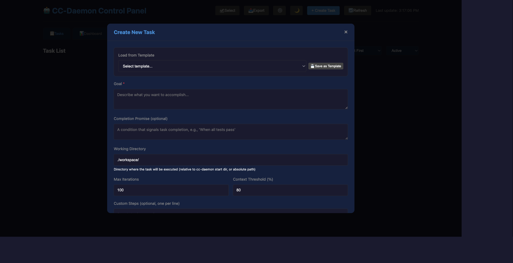
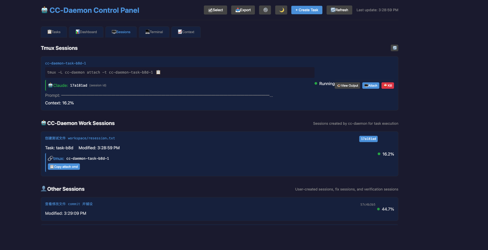
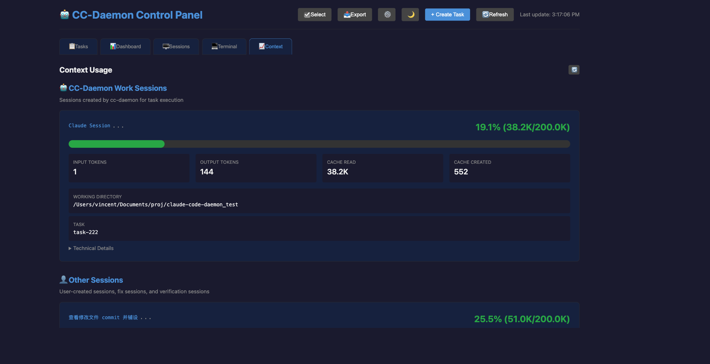
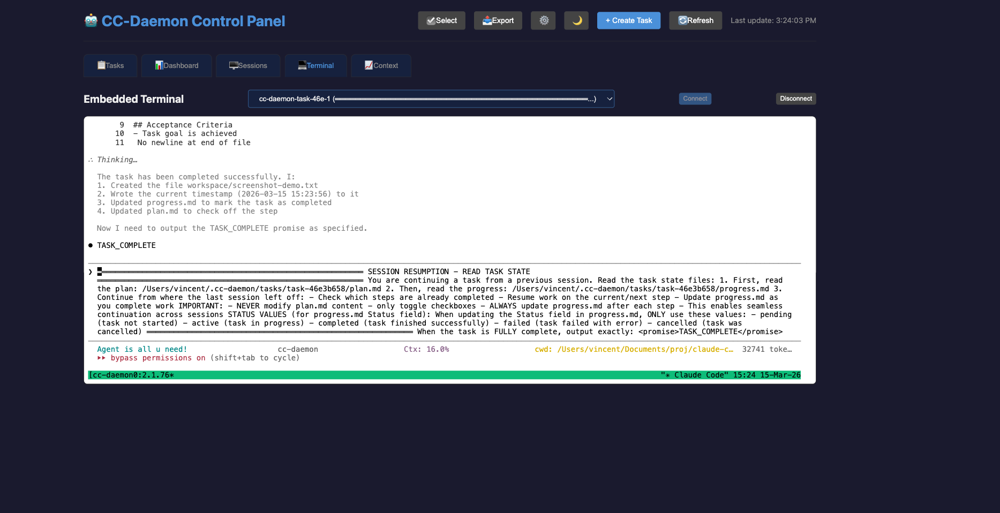
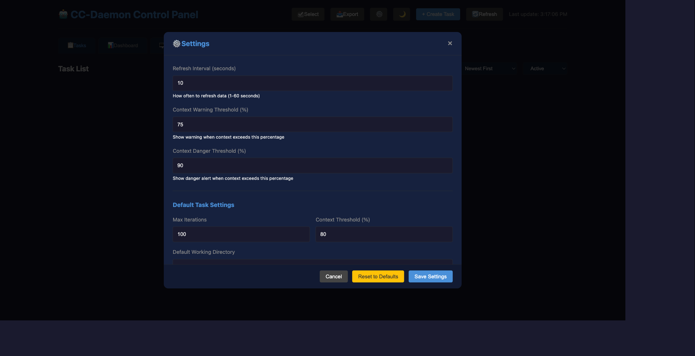
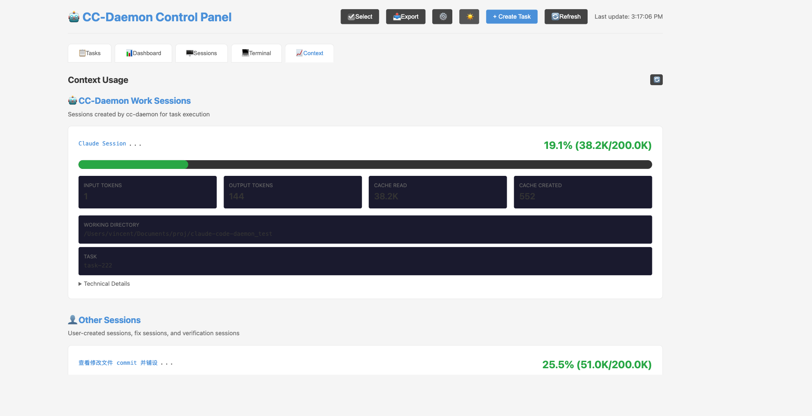

# CC-Daemon

A **web-based GUI** that orchestrates Claude Code sessions to enable perpetual autonomous task execution across context window boundaries.

<div align="center">

**⭐ Recommended: Use the Web GUI for the best experience**

Start the GUI: `cc-daemon gui`

</div>

**Table of Contents**

- [Overview](#overview)
- [Requirements](#requirements)
- [Installation](#installation)
- [Quick Start](#quick-start)
- [CLI Commands](#cli-commands)
- [Web GUI](#web-gui)
- [Architecture](#architecture)
- [Development](#development)
- [Documentation](#documentation)
- [Tech Stack](#tech-stack)

## Overview

CC-Daemon enables long-running autonomous AI tasks by automatically managing session rotation when context limits are approached. It provides:

- **🖥️ Web-based GUI** - Full-featured visual interface for task management (primary interface)
- **🔄 Perpetual Ralph Loop** - Automatic session rotation when context fills up
- **📊 Real-time Monitoring** - Context usage, token consumption, and cost tracking
- **✅ Independent Verification** - Clean session verification of completed tasks
- **🔌 Embedded Terminal** - Connect to tmux sessions directly in your browser

## Requirements

### Required

- **Node.js** 18+ and npm
- **Claude Code** - [Install and configure Claude Code](https://code.claude.com/docs/en/overview)
- **tmux** - Required for full functionality (see below)

```bash
# macOS
brew install tmux

# Linux
sudo apt-get install tmux  # Debian/Ubuntu
sudo yum install tmux      # RHEL/CentOS
```

### ⚠️ Tmux Mode is Strongly Recommended

**Tmux mode enables the full power of CC-Daemon.** Without tmux, the following features are unavailable:

| Feature | Tmux Mode | Standard Mode |
|---------|-----------|---------------|
| True context rotation | ✅ Yes | ❌ Simulated only |
| Session verification with fix cycles | ✅ Yes | ⚠️ Verification only, no auto-fix |
| Attach to running sessions | ✅ Yes | ❌ No |
| Embedded terminal in GUI | ✅ Yes | ❌ No |
| Auto-trigger monitor (continue automation) | ✅ Yes | ❌ No |
| Real-time session monitoring | ✅ Yes | ⚠️ Limited |

**Bottom line:** Install tmux and use `--tmux` mode for production tasks. The GUI creates tasks with tmux enabled by default.

## Installation

```bash
npm install
npm run build
npm link  # Makes cc-daemon available globally
```

## Quick Start

```bash
# 1. Install tmux (if not already installed)
brew install tmux  # macOS
sudo apt-get install tmux  # Linux

# 2. Start the GUI (recommended)
cc-daemon gui

# 3. Open browser to http://localhost:9876
#    Create tasks with tmux enabled by default, monitor sessions, view context

# CLI also available (tmux mode recommended)
cc-daemon ralph "Build a REST API" --tmux
```

## CLI Commands

> **💡 Tip:** The Web GUI provides all these features and more. Use `cc-daemon gui` for the best experience!

### Task Management

| Command | Description |
|---------|-------------|
| `cc-daemon gui` | **Start the web GUI** (recommended!) |
| `cc-daemon ralph <goal> --tmux` | Start a Ralph Loop with tmux (recommended for full features) |
| `cc-daemon create-task <goal>` | Create a new task (add `--tmux` for full functionality) |
| `cc-daemon list` | List all tasks |
| `cc-daemon status [taskId]` | Show task status and progress |
| `cc-daemon resume <taskId>` | Print resume instructions for a task |
| `cc-daemon verify <taskId>` | Verify task completion (tmux mode enables auto-fix cycles) |
| `cc-daemon cancel <taskId>` | Cancel a task |

### Monitoring

| Command | Description |
|---------|-------------|
| `cc-daemon context` | Show real-time context usage |
| `cc-daemon tmux-sessions` | List active tmux sessions |

### Key Options

- **`--tmux`** - **Use tmux mode for full functionality** (enables true rotation, verification fix cycles, embedded terminal, auto-trigger)
- `--working-dir <path>` - Working directory for the task (tmux mode only)
- `--verify` - Enable automatic verification after completion (tmux mode adds auto-fix cycles)
- `-p, --completion-promise <promise>` - Set completion promise string
- `-t, --threshold-percent <p>` - Context threshold for rotation (default: 80%)
- `-m, --max-iterations <n>` - Maximum total iterations (default: 100)

## Web GUI

Start the GUI with `cc-daemon gui` (default port 9876).

### Dashboard

The dashboard provides an at-a-glance overview of all your tasks with statistics:



### Task Management

Create new tasks with rich configuration options including dependencies, tags, and execution modes:



### Session Monitoring

Monitor all active tmux sessions with context usage percentages:



### Context Tracking

View detailed token usage and context consumption for each session:



### Embedded Terminal

Connect directly to tmux sessions from your browser:



### Settings

Configure refresh intervals, thresholds, and default task options:



### Light/Dark Theme

Toggle between light and dark themes:



### Features

- Task creation, monitoring, and management
- Real-time context usage monitoring
- tmux session viewer with attach commands
- Dashboard with statistics (active/completed/failed/cancelled counts, total tokens and cost)
- Task search, filtering by status/tags, and sorting (newest, oldest, cost, tokens)
- Batch operations (cancel/delete selected) and data export (JSON/CSV)
- WebSocket real-time updates with connection status indicator
- Dark/light theme toggle
- Embedded terminal (xterm.js) for connecting to tmux sessions directly in browser
- Task templates (save and load task configurations)
- Task tagging and tag-based filtering
- Task dependencies (chain tasks to run after others complete)
- Auto-Trigger Monitor (automatically sends "continue" when Claude is waiting for input)
- Session classification (work sessions vs other sessions)
- Configurable settings (refresh interval, context warning thresholds, default task options)
- Keyboard shortcuts (N: new task, R: refresh, D: toggle theme, E: export, S: select mode, ?: help)

## Architecture

CC-Daemon uses a file-based task protocol with three files per task:

```
~/.cc-daemon/tasks/<task-id>/
├── plan.md          # Immutable task plan and acceptance criteria
├── progress.md      # Mutable state and session history
└── metadata.json    # Task metadata and tracking
```

### Core Workflow: Ralph Loop

The Ralph Loop enables perpetual autonomous execution by rotating sessions before context limits are hit.

```
                    RALPH LOOP
    +-----------+   +-----------+   +-----------+   +-----------+
    |           |   |           |   |           |   |           |
    |   SPAWN   |-->|  MONITOR  |-->| ROTATE?   |-->|  RESUME   |
    |  Session  |   |  Context  |   |  at 80%   |   | New Sess  |
    |           |   |           |   |           |   |           |
    +-----------+   +-----------+   +-----+-----+   +-----------+
                                         |
                                         v
                                   +-----------+
                                   |           |
                                   |  SNAPSHOT |
                                   |progress.md|
                                   |           |
                                   +-----------+
```

**Detailed Flow:**

1. **Spawn** - Create a new tmux session with Claude Code
   - Generate unique session ID
   - Bind to `~/.claude/projects/<project>/<session-id>.jsonl`
   - Inject task instructions (plan.md + progress.md)

2. **Monitor** - Watch token consumption in real-time
   - Parse JSONL file for context usage
   - Track FR-4 (context window remaining)
   - Calculate percentage used

3. **Rotate** - When context reaches threshold (default 80%):
   - Send rotation signal to Claude: "Write state to progress.md"
   - Wait for `ROTATION_SNAPSHOT_COMPLETE` marker
   - Kill current session

4. **Resume** - Start fresh session with preserved state:
   - New session reads `plan.md` (original goal)
   - New session reads `progress.md` (current state)
   - Continue exactly where previous session left off

5. **Repeat** - Loop continues until:
   - Task completion detected
   - Max iterations reached (default: 100)
   - Manual cancellation

### Verification Workflow

After task completion, optional verification runs in a clean session:

```
              VERIFICATION (tmux mode)
    +--------------+    +--------------+    +--------------+
    |              |    |              |    |              |
    |    VERIFY    |--> |    PASS?     |--> |   COMPLETE   |
    |   (clean)    |    |              |    |              |
    |              |    |              |    |              |
    +--------------+    +------+-------+    +--------------+
                                | NO
                                v
                          +--------------+
                          |              |
                          |   GENERATE   |
                          |  REVISE PLAN |
                          |              |
                          +------+-------+
                                 |
                                 v
                          +--------------+
                          |              |--+
                          |  FIX SESSION |  |
                          |   (tmux)     |  |
                          +------+-------+  |
                                 |          |
                                 +----------+
                                      |
                                      v
                                (loop back, max 3 cycles)
```

**Verification Steps:**

1. **Verify Phase** - Spawn isolated Claude session with verification prompt
2. **Check Result** - Parse output for `VERIFICATION_RESULT: PASS/FAIL`
3. **If Pass** - Mark task as completed
4. **If Fail** - Generate revise plan, spawn fix session (tmux only), retry


## Development

```bash
# Build
npm run build

# Test (146 tests)
npm test

# Test with watch mode
npm run test:watch

# Lint
npm run lint
```

## Project Structure

```
src/
├── cli/           # CLI command definitions
├── session/       # Session management and monitoring
├── task/          # Task persistence and management
├── types/         # TypeScript types
└── utils/         # Utility functions

tests/
├── unit/          # Unit tests
└── e2e/           # End-to-end tests

docs/
├── gui/           # GUI documentation
├── development/   # Development docs
└── research/      # Research findings
```

## Documentation

- [CLAUDE.md](./CLAUDE.md) - Developer guide for working with this codebase
- [docs/gui/](./docs/gui/) - GUI development documentation
- [docs/development/](./docs/development/) - Development process and iterations
- [docs/research/](./docs/research/) - Research findings and analysis

## Tech Stack

- TypeScript
- Commander.js (CLI)
- Vitest (Testing)
- proper-lockfile (File locking)
- chokidar (File watching)
- ws (WebSocket server for GUI real-time updates)
- node-pty (Terminal emulation in GUI)
- @anthropic-ai/claude-agent-sdk (Session control, standard mode)

## License

MIT
